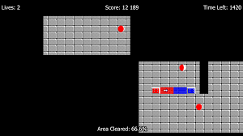

# JezzBall

Faithful Android remake of the 1992 Microsoft Entertainment Pack 3 classic.
Cap off 75% of the field by drawing walls while bouncing atoms try to break
them. **No ads, no IAP, no analytics, no tracking.**

<p align="center">
  
</p>

The art direction is the EGA palette of the original: black field, cyan
walls and borders, red atoms, navy capture fill. All graphics are drawn
procedurally in Godot's `_draw()` (no external assets).

## Install on Android

**Direct APK download:**
https://github.com/Matswm86/jezzball/releases/download/latest/jezzball.apk

1. Open that link in your phone's browser and tap to download.
2. When you tap the downloaded file, Android may say *"For your security, your
   phone is not allowed to install unknown apps from this source."* Tap
   **Settings**, toggle **Allow from this source**, then go back and install.
3. The app appears as **JezzBall**.

> The APK is **debug-signed** with a stable key (stored as the
> `ANDROID_DEBUG_KEYSTORE_BASE64` GitHub secret), so reinstalling a newer
> build over an older one Just Works, no uninstall needed.

Permanent versioned downloads are also published to the
[Releases page](https://github.com/Matswm86/jezzball/releases) when a
`vX.Y.Z` tag is pushed.

## How to play

- Tap the **VERTICAL** / **HORIZONTAL** button (bottom-left) to choose the
  build orientation.
- Tap inside the field. A wall starts at your tap and grows in two
  directions until each end either hits an existing wall or finishes.
- Once a wall completes, every region with **no atoms** in it is captured
  and filled navy.
- **Win** the level when the captured area reaches **75%**.
- **Lose a life** any time an atom touches a wall that's still being built
  (the whole wall vanishes).

### Difficulty

- Level **N** spawns **N** atoms (level 1 = 1 atom, level 50 = 50 atoms).
- Lives per level: **`max(3, N + 2)`** — they refill on retry.
- 50 levels in v0.1; the game loops back to level 1 after.

## Run from source (desktop)

1. Install **Godot 4.6.x** from https://godotengine.org/ (single binary, no
   install needed, just extract and run).
2. Open the editor → **Import** → pick `project.godot` in this folder.
3. Press **F5** (or hit ▶). Mouse acts as touch on desktop.

## CI builds (how the APK gets made)

Every push to `main` triggers `.github/workflows/build-android.yml`, which:

1. Spins up `ubuntu-latest`, installs Java 17 + Android SDK.
2. Downloads Godot 4.6.2 headless + Android export templates.
3. Decodes the stable debug keystore from the `ANDROID_DEBUG_KEYSTORE_BASE64`
   secret (falls back to an ephemeral keystore if the secret isn't set, so
   forks still build).
4. Writes `editor_settings-4.6.tres` and the build template marker files.
5. Runs `godot --headless --export-debug "Android" jezzball.apk`.
6. Uploads the APK as a workflow artifact, **and** updates the rolling
   `latest` pre-release on the Releases page.

For a permanent versioned APK: `git tag v0.1.0 && git push --tags`.

The full debugging history of this workflow lives in `ball-connect`'s
[`docs/godot-android-ci-notes.md`](https://github.com/Matswm86/ball-connect/blob/main/docs/godot-android-ci-notes.md)
— same workflow, same gotchas.

## File map

```
project.godot                   Engine settings (1080×1920 portrait, GL Compat)
export_presets.cfg              Android export preset (gradle build, arm64-v8a)
icon.svg                        App icon
.github/workflows/
  build-android.yml             CI workflow that produces the APK
scenes/
  Game.tscn                     Root scene
scripts/
  Game.gd                       Whole game: grid, ball physics, wall builder,
                                flood-fill capture, HUD, overlays
screenshots/
  inspiration.png               Original JezzBall reference image
```

## Design rules (locked-in defaults)

- Field: **36 cols × 56 rows**, 30 px cells. Viewport: 1080×1920 portrait.
- Atom radius: 13 px. Atom speed: 240 px/s, ±8% per atom.
- Wall growth: 6.5 cells/s (slower than atoms, so timing matters).
- Capture target: **75%** of the playable area.
- Lives: `max(3, level + 2)`. 50 levels.
- Palette (locked):
  | Element | Color |
  |---|---|
  | Background / HUD | `#000000` |
  | Border + completed wall | `#00aaaa` |
  | Wall under construction | `#00ffff` |
  | Captured region | `#000080` |
  | Atom (red) | `#ff5555`, outline `#aa0000` |
  | Text | `#ffffff` |
