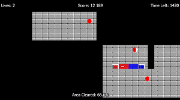

# JezzBall

Faithful Android remake of the 1992 Microsoft Entertainment Pack 3 classic.
Cap off 70% of the field by drawing walls while bouncing atoms try to break
them. **No ads, no IAP, no analytics, no tracking.**

<p align="center">
  
</p>

The art direction borrows the Windows 3.x look of the 1992 original: a light
gray field with grid lines, muted dark-red walls, a muted blue-gray capture
fill, and red atoms with a white highlight, under a black HUD. All graphics are
drawn procedurally in Godot's `_draw()` (no external assets).

## Install on Android

**Direct APK download:**
https://github.com/Matswm86/jezzball/releases/download/latest/jezzball-fresh.apk

1. Open that link in your phone's browser and tap to download.
2. When you tap the downloaded file, Android may say *"For your security, your
   phone is not allowed to install unknown apps from this source."* Tap
   **Settings**, toggle **Allow from this source**, then go back and install.
3. The app appears as **JezzBall**.

> The APK is **debug-signed** with a stable key (stored as the
> `ANDROID_DEBUG_KEYSTORE_BASE64` GitHub secret), so reinstalling a newer
> build over an older one Just Works, no uninstall needed.

Permanent versioned downloads are also published to the
[Releases page](https://github.com/Matswm86/jezzball/releases) when a
`vX.Y.Z` tag is pushed.

## How to play

- Press a cell in the field and swipe up/down for a **vertical** wall or
  left/right for a **horizontal** one, then lift your finger to start it. A
  swipe of at least 25 px sets the direction (a faint preview line shows it
  while your finger is down); a tap without a swipe reuses the previous
  direction.
- The wall grows from that cell in two directions until each end hits the
  border, an existing wall or a captured area.
- Once a wall completes, every region with **no atoms** in it is captured
  and filled blue-gray.
- **Win** the level when completed walls plus captured area reach **70%** of
  the playable field.
- **Lose a life** any time an atom touches a wall that's still being built
  (the whole wall vanishes).
- **RESTART** (top right, above the field) restarts the current level and
  refills its lives.

### Difficulty

- Level **N** spawns **N** atoms (level 1 = 1 atom, level 50 = 50 atoms).
- Lives per level: **`max(3, N + 2)`**, refilled on retry.
- 50 levels in v0.1; the game loops back to level 1 after.

## Run from source (desktop)

1. Install **Godot 4.6.x** from https://godotengine.org/ (single binary, no
   install needed, just extract and run).
2. Open the editor → **Import** → pick `project.godot` in this folder.
3. Press **F5** (or hit ▶). Mouse acts as touch on desktop.

## CI builds (how the APK gets made)

Every push to `main` triggers `.github/workflows/build-android.yml`, which:

1. Spins up `ubuntu-latest`, installs Java 17 + Android SDK.
2. Downloads Godot 4.6.2 headless + Android export templates.
3. Decodes the stable debug keystore from the `ANDROID_DEBUG_KEYSTORE_BASE64`
   secret (falls back to an ephemeral keystore if the secret isn't set, so
   forks still build).
4. Writes `editor_settings-4.6.tres` and the build template marker files.
5. Runs `godot --headless --export-debug "Android" jezzball-fresh.apk`.
6. Uploads the APK as a workflow artifact, **and** updates the rolling
   `latest` pre-release on the Releases page.

For a permanent versioned APK: `git tag v0.1.0 && git push --tags`.

A second workflow, `.github/workflows/gdlint.yml`, runs `gdformat --check` and
`gdlint` on pushes and pull requests that touch `.gd` files. The format check
must pass; `gdlint` is advisory for now.

The full debugging history of this workflow lives in `ball-connect`'s
[`docs/godot-android-ci-notes.md`](https://github.com/Matswm86/ball-connect/blob/main/docs/godot-android-ci-notes.md).
Same workflow, same gotchas.

## File map

```
project.godot                   Engine settings (1080×1920 portrait, GL Compat)
export_presets.cfg              Android export preset (gradle build, arm64-v8a)
icon.svg                        App icon
.pre-commit-config.yaml         Pre-commit hooks: file checks + detect-secrets
                                (baseline in .secrets.baseline)
.github/workflows/
  build-android.yml             CI workflow that produces the APK
  gdlint.yml                    gdformat --check + gdlint on .gd changes
scenes/
  Game.tscn                     Root scene
scripts/
  Game.gd                       Whole game: grid, ball physics, wall builder,
                                flood-fill capture, HUD, overlays
screenshots/
  inspiration.png               Original JezzBall reference image
```

## Design rules (locked-in defaults)

- Field: **18 cols × 25 rows** including the border ring (16 × 23 playable),
  60 px cells. Viewport: 1080×1920 portrait.
- Atom radius: 22 px. Atom speed: 380 px/s, ±8% per atom.
- Wall growth: 9 cells/s per end (faster than the atoms).
- Capture target: **70%** of the playable area.
- Lives: `max(3, level + 2)`. 50 levels.
- Palette (the `Color()` constants at the top of `scripts/Game.gd`, rounded to
  hex):
  | Element | Hex | Notes |
  |---|---|---|
  | Field | `#CCCCCC` | light gray cells |
  | Grid lines | `#9E9E9E` | between cells |
  | Border | `#1A1A1A` | near-black |
  | HUD + outer background | `#000000` | black |
  | Wall (completed) | `#8C1A1A` | muted dark red |
  | Wall (under construction) | `#C72E2E` | brighter red on growing tip |
  | Captured region + progress bar | `#6B759E` | muted blue-gray |
  | Atom base | `#A61F1F` | red |
  | Atom highlight | `#FFFFFF` | small white dot |
  | Atom outline | `#400000` | dark red |
  | Text | `#FFFFFF` | white on the black HUD |
